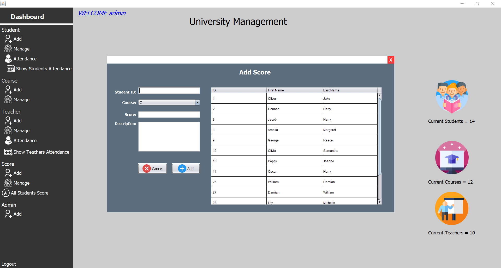
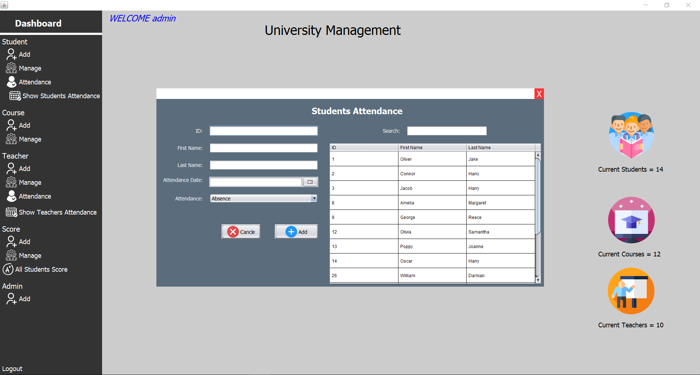

<h1 align="center" color="red";>University-Management-System-java-swing</h1>
University Management System only admin can able to access this system and you are able to add more admin. This University Management system stores students data, students score, students attendance, teachers data, teachers attendance, courses and students score. 

<h2>Using Software Tools:</h2>

NetBeans IDE 8.2 
MySql (XAMPP Control Panel v3.2.4) 
MySql JDBC Driver-mysql-connector-java 
  
<h3>Admin login: </h3>
<h4>username:</h4> admin
<h4>password:</h4> admin 
<h2>More Details:
<a href="https://www.pcodep.com/2022/02/university-management-system-java-swing.html">www.pcodep.com</a></h2>
 <h2 align="center">
   
</h2>

 <h2 align="center">
   
</h2>

 <h2 align="center">
   
</h2>

 <h2 align="center">
   
</h2>

 <h2 align="center">
   
</h2>

<h2 align="center">
   
</h2>

 <h2 align="center">
   
</h2>

 <h2 align="center">
   
</h2>

 <h2 align="center">
   
</h2>
 <h2 align="center">
   
</h2>
 <h2 align="center">
   
</h2>
 <h2 align="center">
   
</h2>
